

  <picture>
    <source media="(prefers-color-scheme: dark)" srcset="assets/dark/hero.svg">
    
  </picture>

  <a href="https://www.linkedin.com/in/kavinjs/"><picture>
    <source media="(prefers-color-scheme: dark)" srcset="assets/dark/link-linkedin.svg">
    
  </picture></a>
  <a href="https://kavinjs.me"><picture>
    <source media="(prefers-color-scheme: dark)" srcset="assets/dark/link-portfolio.svg">
    
  </picture></a>
  <a href="https://leetcode.com/u/kavinjs/"><picture>
    <source media="(prefers-color-scheme: dark)" srcset="assets/dark/link-leetcode.svg">
    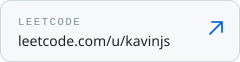
  </picture></a>
  <a href="mailto:kavinjs.dev@gmail.com"><picture>
    <source media="(prefers-color-scheme: dark)" srcset="assets/dark/link-email.svg">
    
  </picture></a>

  <picture>
    <source media="(prefers-color-scheme: dark)" srcset="assets/dark/intro.svg">
    
  </picture>

  <picture>
    <source media="(prefers-color-scheme: dark)" srcset="assets/dark/h-glance.svg">
    
  </picture>

  <picture>
    <source media="(prefers-color-scheme: dark)" srcset="assets/dark/stats.svg">
    
  </picture>

  <picture>
    <source media="(prefers-color-scheme: dark)" srcset="assets/dark/skyline.svg">
    
  </picture>

  <picture>
    <source media="(prefers-color-scheme: dark)" srcset="assets/dark/h-work.svg">
    
  </picture>

  <a href="https://github.com/Kavin-JS/RagForge"><picture>
    <source media="(prefers-color-scheme: dark)" srcset="assets/dark/proj-rag.svg">
    
  </picture></a>
  <a href="https://github.com/Kavin-JS/AIKA"><picture>
    <source media="(prefers-color-scheme: dark)" srcset="assets/dark/proj-aika.svg">
    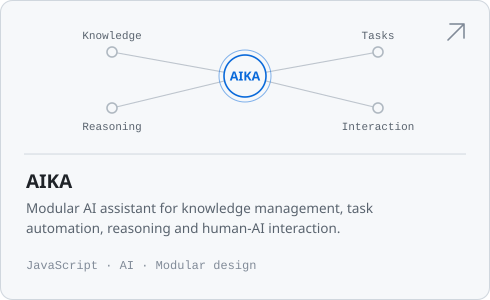
  </picture></a>
  <a href="https://github.com/Kavin-JS/BLE-Classroom-Presence"><picture>
    <source media="(prefers-color-scheme: dark)" srcset="assets/dark/proj-ble.svg">
    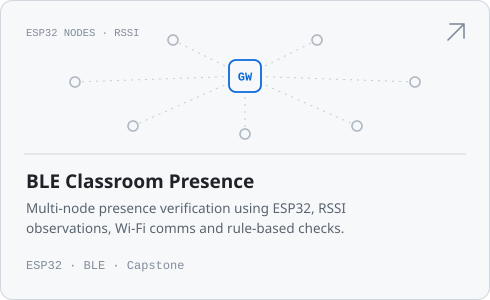
  </picture></a>
  <a href="https://github.com/Kavin-JS/Voice-Wake-Word-System"><picture>
    <source media="(prefers-color-scheme: dark)" srcset="assets/dark/proj-voice.svg">
    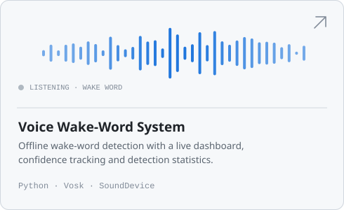
  </picture></a>
  <a href="https://github.com/Kavin-JS/GrovX"><picture>
    <source media="(prefers-color-scheme: dark)" srcset="assets/dark/proj-grovx.svg">
    
  </picture></a>
  <a href="https://github.com/Kavin-JS/TransportSense"><picture>
    <source media="(prefers-color-scheme: dark)" srcset="assets/dark/proj-transport.svg">
    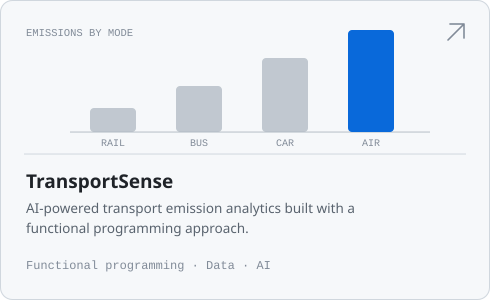
  </picture></a>

  <a href="https://github.com/Kavin-JS/Real-Time-Recommendation-System"><picture>
    <source media="(prefers-color-scheme: dark)" srcset="assets/dark/mini-recsys.svg">
    
  </picture></a>
  <a href="https://github.com/Kavin-JS/AMLC26"><picture>
    <source media="(prefers-color-scheme: dark)" srcset="assets/dark/mini-amlc.svg">
    
  </picture></a>
  <picture>
    <source media="(prefers-color-scheme: dark)" srcset="assets/dark/mini-esp32.svg">
    
  </picture>
  <a href="https://kavinjs.me"><picture>
    <source media="(prefers-color-scheme: dark)" srcset="assets/dark/mini-portfolio.svg">
    
  </picture></a>
  <a href="https://github.com/Kavin-JS/Shonowear-Ver4.0"><picture>
    <source media="(prefers-color-scheme: dark)" srcset="assets/dark/mini-shono.svg">
    
  </picture></a>
  <a href="https://github.com/Kavin-JS/Data_Structures_and_Algorithms"><picture>
    <source media="(prefers-color-scheme: dark)" srcset="assets/dark/mini-dsa.svg">
    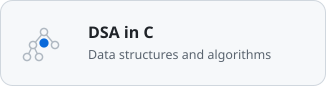
  </picture></a>

  <picture>
    <source media="(prefers-color-scheme: dark)" srcset="assets/dark/h-recent.svg">
    
  </picture>

  <picture>
    <source media="(prefers-color-scheme: dark)" srcset="assets/dark/activity.svg">
    
  </picture>

  <picture>
    <source media="(prefers-color-scheme: dark)" srcset="assets/dark/h-exp.svg">
    
  </picture>

  <picture>
    <source media="(prefers-color-scheme: dark)" srcset="assets/dark/experience.svg">
    
  </picture>

  <picture>
    <source media="(prefers-color-scheme: dark)" srcset="assets/dark/h-skills.svg">
    
  </picture>

  <picture>
    <source media="(prefers-color-scheme: dark)" srcset="assets/dark/skills.svg">
    
  </picture>

  <picture>
    <source media="(prefers-color-scheme: dark)" srcset="assets/dark/h-certs.svg">
    
  </picture>

  <picture>
    <source media="(prefers-color-scheme: dark)" srcset="assets/dark/certs.svg">
    
  </picture>

  <picture>
    <source media="(prefers-color-scheme: dark)" srcset="assets/dark/h-contact.svg">
    
  </picture>

  <picture>
    <source media="(prefers-color-scheme: dark)" srcset="assets/dark/contact.svg">
    
  </picture>

  <a href="https://www.linkedin.com/in/kavinjs/"><picture>
    <source media="(prefers-color-scheme: dark)" srcset="assets/dark/link-linkedin.svg">
    
  </picture></a>
  <a href="https://kavinjs.me"><picture>
    <source media="(prefers-color-scheme: dark)" srcset="assets/dark/link-portfolio.svg">
    
  </picture></a>
  <a href="https://leetcode.com/u/kavinjs/"><picture>
    <source media="(prefers-color-scheme: dark)" srcset="assets/dark/link-leetcode.svg">
    
  </picture></a>
  <a href="mailto:kavinjs.dev@gmail.com"><picture>
    <source media="(prefers-color-scheme: dark)" srcset="assets/dark/link-email.svg">
    
  </picture></a>

Plain-text version

Computer science student at Amrita Vishwa Vidyapeetham, Chennai. I build AI pipelines, full-stack web applications and embedded systems, and lead PR for AMCFOSS. Looking for internship and placement opportunities in software engineering and AI/ML.

[LinkedIn](https://www.linkedin.com/in/kavinjs/) · [Portfolio](https://kavinjs.me) · [LeetCode](https://leetcode.com/u/kavinjs/) · [Email](mailto:kavinjs.dev@gmail.com)

**Selected work:** [RagForge](https://github.com/Kavin-JS/RagForge) · [AIKA](https://github.com/Kavin-JS/AIKA) · [BLE Classroom Presence](https://github.com/Kavin-JS/BLE-Classroom-Presence) · [Voice Wake-Word System](https://github.com/Kavin-JS/Voice-Wake-Word-System) · [GrovX](https://github.com/Kavin-JS/GrovX) · [TransportSense](https://github.com/Kavin-JS/TransportSense) · [Real-Time Recommendation System](https://github.com/Kavin-JS/Real-Time-Recommendation-System) · [AMLC26](https://github.com/Kavin-JS/AMLC26) · [ShonoWear](https://github.com/Kavin-JS/Shonowear-Ver4.0) · [DSA in C](https://github.com/Kavin-JS/Data_Structures_and_Algorithms)

**Experience:** Prompt Engineering Intern, SkillCraft Technology (Jan 2026 – Feb 2026). PR Lead, AMCFOSS.

**Skills:** Python, C (strongest); Java, Haskell, JavaScript, SQL, Bash, Git, Linux; learning C++ and modern web development.

**Certifications:** Prompt Engineering, AI-first Software Engineering, Introduction to OpenAI GPT Models (Infosys Springboard); SQL Advanced (HackerRank).

