<p align="center">
  
</p>

<p align="center">
  <a href="https://www.linkedin.com/in/kavinjs/"></a>
  <a href="https://leetcode.com/u/kavinjs/"></a>
  <a href="https://kavin-js.github.io"></a>
  <a href="mailto:kavinjs.dev@gmail.com"></a>
</p>

<p align="center"></p>

<p align="center"></p>

<p align="center"></p>

## `// MISSION LOG`

- 🎯 **Now:** placement prep, DSA grind, shipping real projects
- 🛠️ **Building:** BLE attendance capstone · Astra voice wake system · ESP32 experiments
- 📚 **Leveling up:** JavaScript, modern web dev, C++
- 🤝 **Open to:** internships, open-source collabs, hackathons

---

## `// ARSENAL`

<p align="center">
  
</p>

| Clearance | Stack |
|:--|:--|
| 🟢 **Primary** | `C` `Python` |
| 🟡 **Secondary** | `Java` `Haskell` `Bash` `SQL` `Git` `Linux` `Flask` |
| 🔵 **Training** | `JavaScript` `Modern Web Dev` `C++` |

---

## `// PROJECT FILES`

<table>
<tr>
<td width="50%" valign="top">

### 📡 BLE Attendance System
Capstone: multi-node Bluetooth Low Energy classroom attendance.<br/>
`Embedded` `BLE` `IoT`<br/>
<a href="https://github.com/Kavin-JS">🔗 Repo</a> <!-- TODO: repo link -->

</td>
<td width="50%" valign="top">

### 🎙️ Astra — Voice Wake System
Real-time wake-word detection with a desktop demo and a browser dashboard.<br/>
`Python` `Flask` `Audio`<br/>
<a href="https://github.com/Kavin-JS">🔗 Repo</a> <!-- TODO: repo link -->

</td>
</tr>
<tr>
<td width="50%" valign="top">

### 📶 ESP32 Wi-Fi Extender
STA + SoftAP + NAT repeater on an ESP32, built in the Arduino IDE.<br/>
`ESP32` `Networking` `C++`<br/>
<a href="https://github.com/Kavin-JS">🔗 Repo</a> <!-- TODO: repo link -->

</td>
<td width="50%" valign="top">

### 🦾 Iron Man HUD
Multi-panel Conky HUD on Kali Linux / KDE Wayland.<br/>
`Linux` `Conky`<br/>
<a href="https://github.com/Kavin-JS">🔗 Repo</a> <!-- TODO: repo link -->

</td>
</tr>
<tr>
<td width="50%" valign="top">

### 🛍️ [ShonoWear v4.0](https://github.com/Kavin-JS/Shonowear-Ver4.0)
Anime-inspired streetwear platform with interactive UI concepts.<br/>
`HTML` `CSS` `JS`

</td>
<td width="50%" valign="top">

### 🧠 [Prompt Engineering Tasks](https://github.com/Kavin-JS/SkillCraftTechnology_PromptEngineering_Tasks)
Structured prompting and AI workflow experiments.<br/>
`AI` `Prompts` `JSON`

</td>
</tr>
</table>

<p align="center">
  <a href="https://kavin-js.github.io"><b>🌐 Portfolio</b></a> &nbsp;·&nbsp;
  <a href="https://github.com/Kavin-JS/DSA-3rd-SEM"><b>🌲 DSA in C</b></a>
</p>

---

## `// SERVICE RECORD`

<details open>
<summary><b>🏢 Prompt Engineering Intern — SkillCraft Technology</b> &nbsp;<code>Jan – Feb 2026</code></summary>
<br/>

| Contribution | Details |
|---|---|
| **Prompt Structuring** | Turned vague instructions into deterministic prompts with constraints and role definitions |
| **Structured Output** | Designed prompts that convert unstructured text into reliable JSON |
| **Agent Workflows** | Built multi-turn assistants: interview bot, tutoring agent, task assistant |
| **Evaluation** | Iteratively refined prompts and measured output consistency |

</details>

<details>
<summary><b>🐧 PR Lead — AMCFOSS</b> &nbsp;<code>Amrita Free and Open Source Software Club</code></summary>
<br/>

Club communications, sponsorship outreach, and partnership materials.

</details>

<details>
<summary><b>🏆 Certifications</b></summary>
<br/>


</details>

---

## `// TELEMETRY`

<p align="center">
  <picture>
    <source media="(prefers-color-scheme: dark)" srcset="https://raw.githubusercontent.com/Kavin-JS/Kavin-JS/output/github-snake-dark.svg" />
    <source media="(prefers-color-scheme: light)" srcset="https://raw.githubusercontent.com/Kavin-JS/Kavin-JS/output/github-snake.svg" />
    
  </picture>
</p>

<p align="center">
  <a href="https://leetcode.com/u/kavinjs/"></a>
</p>

<p align="center">
  
  
</p>

<p align="center">
  
</p>

---

<details>
<summary><b>🔓 Run protocol: MARK-II</b></summary>
<br/>

```text
> sudo ./hire_kavin.sh
[sudo] password for recruiter: ********
Authenticating ........ OK
Loading resume ........ OK
Checking LeetCode ..... 100+ solved, 32-day streak
Compiling coffee ...... 0 errors, 3 warnings
Result: strong candidate detected 🚀

→ kavinjs.dev@gmail.com
```

</details>

<p align="center"></p>

<p align="center">
  <b>Structured Thinking &nbsp;•&nbsp; Reliable Execution &nbsp;•&nbsp; Continuous Improvement</b>
</p>
