<p align="center">
  
</p>

<p align="center">
  <a href="https://www.linkedin.com/in/kavinjs/"></a>
  <a href="https://leetcode.com/u/kavinjs/"></a>
  <a href="https://kavinjs.me"></a>
  <a href="mailto:kavinjs.dev@gmail.com"></a>
  
</p>

<p align="center"></p>

<p align="center">
  
  
</p>

<p align="center"></p>

<p align="center"></p>

<p align="center"></p>

<p align="center"></p>

<p align="center"></p>

<p align="center"></p>

<p align="center">
  <a href="https://github.com/Kavin-JS/GrovX"></a>
  <a href="https://github.com/Kavin-JS/TransportSense"></a>
  <a href="https://github.com/Kavin-JS/Voice-Wake-Word-System"></a>
  
  
  
</p>

<p align="center">
  <a href="https://kavinjs.me"></a>
  <a href="https://github.com/Kavin-JS/Data_Structures_and_Algorithms"></a>
  <a href="https://github.com/Kavin-JS/Shonowear-Ver4.0"></a>
</p>

<p align="center"></p>

<p align="center"></p>

<p align="center">
  <picture>
    <source media="(prefers-color-scheme: dark)" srcset="https://raw.githubusercontent.com/Kavin-JS/Kavin-JS/output/github-snake-dark.svg" />
    <source media="(prefers-color-scheme: light)" srcset="https://raw.githubusercontent.com/Kavin-JS/Kavin-JS/output/github-snake.svg" />
    
  </picture>
</p>

<p align="center"></p>

<p align="center"></p>

<details>
<summary><b>🔓 Run protocol: MARK-II</b></summary>
<br/>

```text
> sudo ./hire_kavin.sh
[sudo] password for recruiter: ********
Authenticating ........ OK
Loading resume ........ OK
Checking LeetCode ..... solved, streak intact
Compiling coffee ...... 0 errors, 3 warnings
Result: strong candidate detected 🚀

→ kavinjs.dev@gmail.com
```

</details>

<p align="center"><sub>Structured Thinking &nbsp;•&nbsp; Reliable Execution &nbsp;•&nbsp; Continuous Improvement</sub></p>
