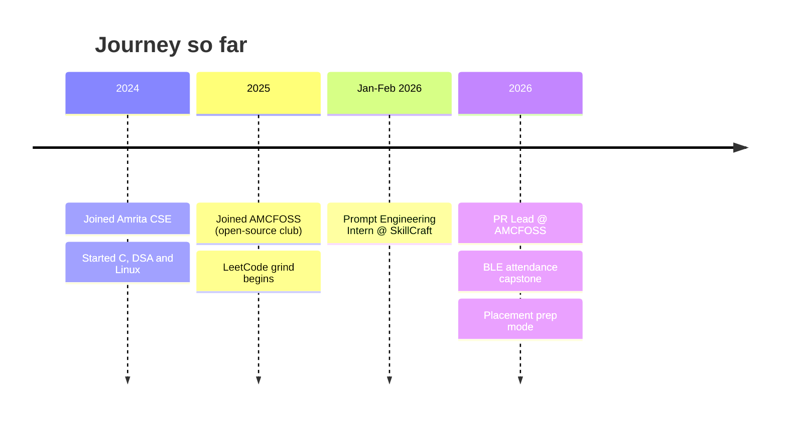

<p align="center">
  
</p>

<p align="center">
  <a href="https://www.linkedin.com/in/kavinjs/"></a>
  <a href="https://leetcode.com/u/kavinjs/"></a>
  <a href="https://kavin-js.github.io"></a>
  <a href="mailto:kavinjs.dev@gmail.com"></a>
  
</p>

---

## 🖥️ `~/about.sh`

```bash
$ cat about.sh
```

```python
class Kavin:
    name       = "Kavin J S"
    location   = "Chennai, India 📍"
    education  = "B.Tech CSE @ Amrita Vishwa Vidyapeetham"
    role       = ["PR Lead @ AMCFOSS", "Prompt Engineering Intern (ex-SkillCraft)"]
    works_on   = ["Full-stack", "AI / ML", "Embedded systems"]
    daily_driver = "Linux + CLI 🐧"
    leetcode   = "100+ solved | 32-day max streak 🔥"

    def current_mission(self):
        return "Placements prep + shipping real projects"

    def open_to(self):
        return ["Internships", "Open-source collabs", "Hackathons"]
```

---

## 🎮 Player Stats

<table align="center">
<tr>
<td align="center"><b>🧩 100+</b><br/>LeetCode solved</td>
<td align="center"><b>🔥 32</b><br/>day max streak</td>
<td align="center"><b>🏅 4</b><br/>certifications</td>
<td align="center"><b>🤖 4</b><br/>AI agents built</td>
<td align="center"><b>🐧 Daily</b><br/>Linux driver</td>
</tr>
</table>

---

## 🛠 Tech Arsenal

<p align="center">
  
</p>

| Level | Stack |
|:--|:--|
| 🟢 **Comfortable** | `C` `Python` |
| 🟡 **Familiar** | `Java` `Haskell` `Bash` `SQL` `Git` `Linux` `Flask` |
| 🔵 **Leveling up** | `JavaScript` `Modern Web Dev` `C++` |

---

## 🚀 Featured Projects

<table>
<tr>
<td width="50%" valign="top">

### 📡 BLE Attendance System
Capstone: multi-node Bluetooth Low Energy classroom attendance.<br/>
`Embedded` `BLE` `IoT`<br/>
<a href="https://github.com/Kavin-JS">🔗 Repo</a> <!-- TODO: replace with repo link -->

</td>
<td width="50%" valign="top">

### 🎙️ Astra — Voice Wake System
Real-time wake-word detection with a desktop demo and a browser dashboard.<br/>
`Python` `Flask` `Audio`<br/>
<a href="https://github.com/Kavin-JS">🔗 Repo</a> <!-- TODO: replace with repo link -->

</td>
</tr>
<tr>
<td width="50%" valign="top">

### 📶 ESP32 Wi-Fi Extender
ESP32 repeater built with STA + SoftAP + NAT in the Arduino IDE.<br/>
`ESP32` `Networking` `C++`<br/>
<a href="https://github.com/Kavin-JS">🔗 Repo</a> <!-- TODO: replace with repo link -->

</td>
<td width="50%" valign="top">

### 🦾 Iron Man HUD
Multi-panel Conky HUD on Kali Linux / KDE Wayland.<br/>
`Linux` `Conky` `Rice`<br/>
<a href="https://github.com/Kavin-JS">🔗 Repo</a> <!-- TODO: replace with repo link -->

</td>
</tr>
<tr>
<td width="50%" valign="top">

### 🛍️ [ShonoWear v4.0](https://github.com/Kavin-JS/Shonowear-Ver4.0)
Anime-inspired streetwear platform with interactive UI concepts.<br/>
`HTML` `CSS` `JS`

</td>
<td width="50%" valign="top">

### 🌐 [Personal Portfolio](https://kavin-js.github.io)
Developer portfolio showcasing projects, skills, and progress.<br/>
`HTML` `CSS` `JS`

</td>
</tr>
<tr>
<td width="50%" valign="top">

### 🧠 [Prompt Engineering Tasks](https://github.com/Kavin-JS/SkillCraftTechnology_PromptEngineering_Tasks)
Structured prompting exercises and AI workflow experiments.<br/>
`AI` `Prompts` `JSON`

</td>
<td width="50%" valign="top">

### 🌲 [DSA — 3rd Semester](https://github.com/Kavin-JS/DSA-3rd-SEM)
Core data structure implementations from coursework.<br/>
`C` `DSA`

</td>
</tr>
</table>

---

## 💼 Experience



<details>
<summary><b>🏢 Prompt Engineering Intern — SkillCraft Technology</b> &nbsp;<code>Jan 2026 – Feb 2026</code></summary>
<br/>

| Contribution | Details |
|---|---|
| **Prompt Structuring** | Turned vague instructions into deterministic prompts with constraints and role definitions |
| **Structured Output** | Designed prompts that convert unstructured text into reliable JSON |
| **Agent Workflows** | Built multi-turn assistants: interview bot, tutoring agent, task assistant |
| **Evaluation** | Iteratively refined prompts and measured output consistency |

</details>

<details>
<summary><b>🐧 PR Lead — AMCFOSS (Amrita Free and Open Source Software Club)</b></summary>
<br/>

Leading club communications, sponsorship outreach, and partnership materials.

</details>

---

## 🏆 Certifications

<p align="center">
  
  
  
  
</p>

---

## 🐍 Contribution Snake

<p align="center">
  <picture>
    <source media="(prefers-color-scheme: dark)" srcset="https://raw.githubusercontent.com/Kavin-JS/Kavin-JS/output/github-snake-dark.svg" />
    <source media="(prefers-color-scheme: light)" srcset="https://raw.githubusercontent.com/Kavin-JS/Kavin-JS/output/github-snake.svg" />
    
  </picture>
</p>

---

## 📈 Stats

<p align="center">
  <a href="https://leetcode.com/u/kavinjs/">
    
  </a>
</p>

<p align="center">
  
  
</p>

<p align="center">
  
</p>

<p align="center">
  
</p>

<p align="center">
  
</p>

---

## 🎯 Current Quests

- [x] Prompt Engineering internship
- [x] 100+ LeetCode problems
- [ ] 200 LeetCode problems
- [ ] Ship the BLE attendance capstone
- [ ] Level up in JavaScript and modern web dev
- [ ] Land a summer internship / placement

---

## 🤝 Let's Connect

<p align="center">
  Ping me for <b>open-source</b>, <b>AI workflow</b> or <b>embedded</b> collabs.<br/><br/>
  <a href="https://www.linkedin.com/in/kavinjs/"></a>
  <a href="https://leetcode.com/u/kavinjs/"></a>
  <a href="mailto:kavinjs.dev@gmail.com"></a>
</p>


<p align="center">
  <b>Structured Thinking &nbsp;•&nbsp; Reliable Execution &nbsp;•&nbsp; Continuous Improvement</b>
</p>
